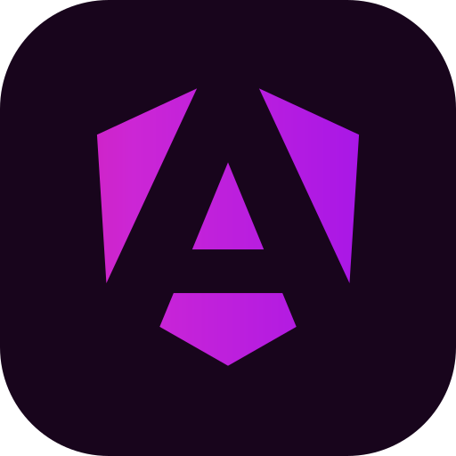

# Website Technology Icons (`wticons`)

## Install

```shell
yarn add @wticons/react
yarn add @wticons/astro
```

## Credits

* [SVGPorn](https://svgporn.com/) - A huge collection of SVG logos by [@gilbarbara](https://github.com/gilbarbara)
* [devicon](https://devicon.dev) - a set of icons representing programming languages, designing, and development tools.
* [SVGO](https://github.com/svg/svgo) - Node.js tool for optimizing SVG files

## Icons

[](icons/adobe-illustrator.svg)
[](icons/adobe-lightroom.svg)
[](icons/adobe-photoshop.svg)
[](icons/adobe-premiere.svg)
[](icons/affinity-designer.svg)
[](icons/angular.svg)
[](icons/apple.svg)
[](icons/astro.svg)
[](icons/ava.svg)
[](icons/bash.svg)
[](icons/bootstrap.svg)
[](icons/bun.svg)
[](icons/css.svg)
[](icons/cypress.svg)
[](icons/debian.svg)
[](icons/docker.svg)
[](icons/doctrine.svg)
[](icons/git.svg)
[](icons/github-copilot.svg)
[](icons/github.svg)
[](icons/gnu-make.svg)
[](icons/go.svg)
[](icons/html.svg)
[](icons/j-query.svg)
[](icons/js.svg)
[](icons/laravel.svg)
[](icons/less.svg)
[](icons/linux.svg)
[](icons/mariadb.svg)
[](icons/mint.svg)
[](icons/mocha.svg)
[](icons/mongodb.svg)
[](icons/my-sql.svg)
[](icons/nette.svg)
[](icons/next-js.svg)
[](icons/nodejs.svg)
[](icons/npm.svg)
[](icons/opensuse.svg)
[](icons/parcel.svg)
[](icons/php-storm.svg)
[](icons/php-unit.svg)
[](icons/php.svg)
[](icons/postcss.svg)
[](icons/postgres.svg)
[](icons/preact.svg)
[](icons/python.svg)
[](icons/react.svg)
[](icons/redhat.svg)
[](icons/redis.svg)
[](icons/rust.svg)
[](icons/sass.svg)
[](icons/stylus.svg)
[](icons/svelte.svg)
[](icons/symfony.svg)
[](icons/tailwind.svg)
[](icons/type-script.svg)
[](icons/ubuntu.svg)
[](icons/vite.svg)
[](icons/vue-use.svg)
[](icons/vue.svg)
[](icons/webpack.svg)
[](icons/windows.svg)
[](icons/wordpress.svg)
[](icons/yarn.svg)
[](icons/zend-framework.svg)

## License

[MIT](./LICENSE)