# Website Technology Icons (`wticons`)

## Install

```shell
yarn add @wticons/react
yarn add @wticons/astro
```

## Credits

* [SVGPorn](https://svgporn.com/) - A huge collection of SVG logos by [@gilbarbara](https://github.com/gilbarbara)
* [devicon](https://devicon.dev) - a set of icons representing programming languages, designing, and development tools.
* [SVGO](https://github.com/svg/svgo) - Node.js tool for optimizing SVG files

## Icons

[](icons/adobe-lightroom.svg)
[](icons/adobe-photoshop.svg)
[](icons/adobe-premiere.svg)
[](icons/adobe-xd.svg)
[](icons/affinity-designer.svg)
[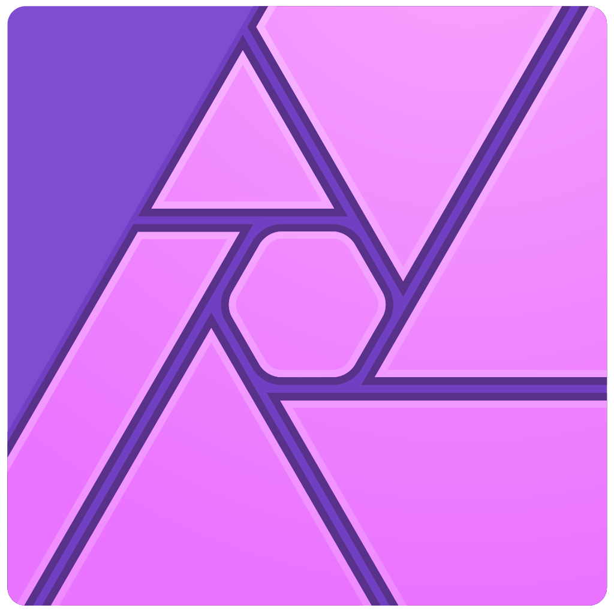](icons/affinity-photo.svg)
[](icons/android.svg)
[](icons/angularjs.svg)
[](icons/anthropic.svg)
[](icons/apache.svg)
[](icons/apple.svg)
[](icons/astro.svg)
[](icons/atom.svg)
[](icons/ava.svg)
[](icons/aws.svg)
[](icons/azure.svg)
[](icons/babel.svg)
[](icons/backbone-js.svg)
[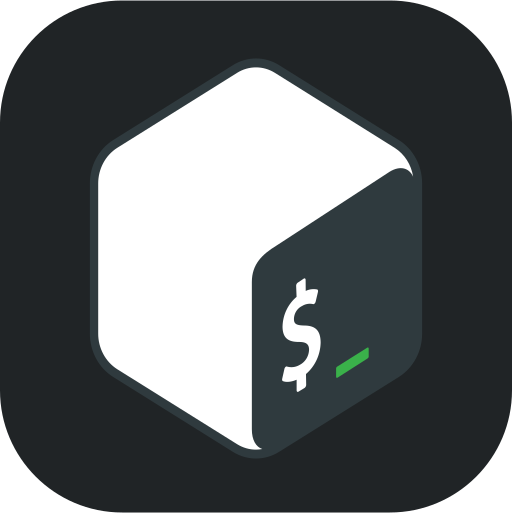](icons/bash.svg)
[](icons/behance.svg)
[](icons/biomejs.svg)
[](icons/bitbucket.svg)
[](icons/bluesky.svg)
[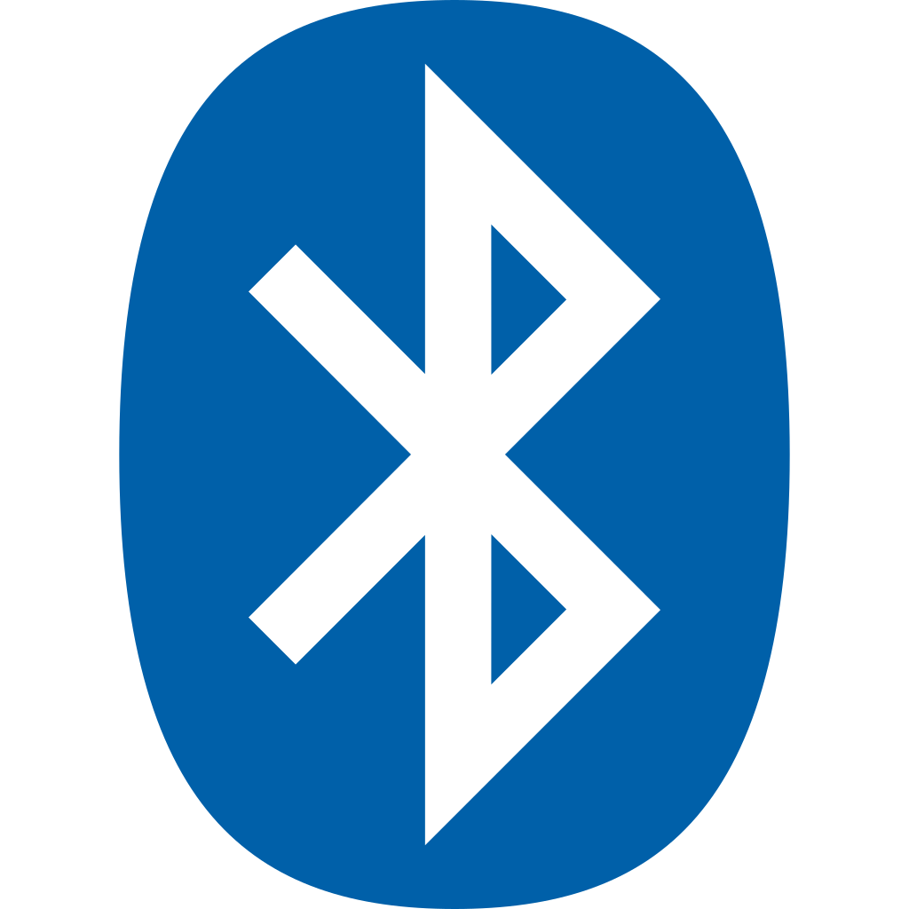](icons/bluetooth.svg)
[](icons/bootstrap.svg)
[](icons/bower.svg)
[](icons/brave.svg)
[](icons/bun.svg)
[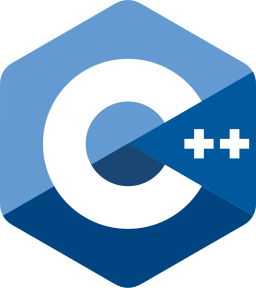](icons/c-plusplus.svg)
[](icons/c.svg)
[](icons/cakephp.svg)
[](icons/capistrano.svg)
[](icons/centos.svg)
[](icons/chrome.svg)
[](icons/circleci.svg)
[](icons/clojure-script.svg)
[](icons/clojure.svg)
[](icons/codeigniter.svg)
[](icons/coffeescript.svg)
[](icons/composer.svg)
[](icons/couch-db.svg)
[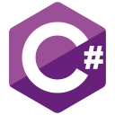](icons/csharp.svg)
[](icons/css3.svg)
[](icons/cucumber.svg)
[](icons/cypress.svg)
[](icons/d3js.svg)
[](icons/dart.svg)
[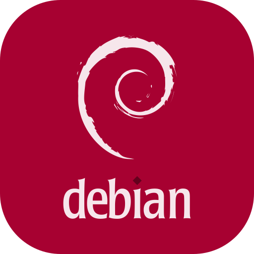](icons/debian.svg)
[](icons/deno.svg)
[](icons/digital-ocean.svg)
[](icons/discord.svg)
[](icons/django.svg)
[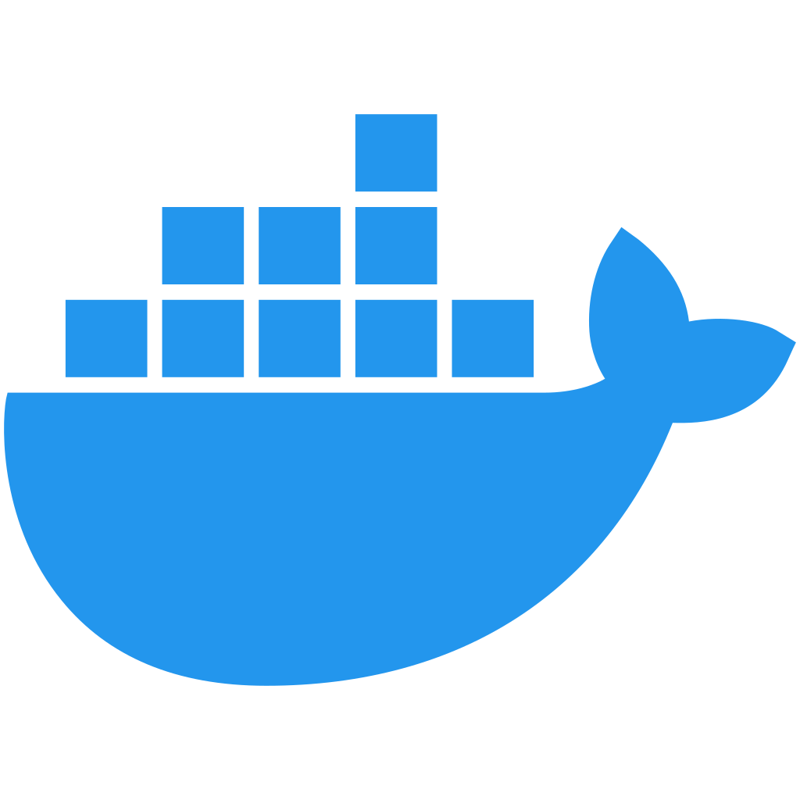](icons/docker.svg)
[](icons/doctrine.svg)
[](icons/dotnet.svg)
[](icons/drupal.svg)
[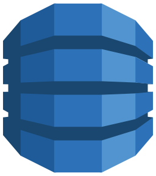](icons/dynamodb.svg)
[](icons/edge.svg)
[](icons/electron.svg)
[](icons/eleventy.svg)
[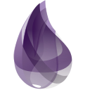](icons/elixir.svg)
[](icons/elm.svg)
[](icons/ember.svg)
[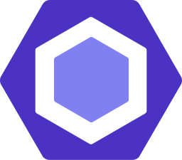](icons/eslint.svg)
[](icons/express.svg)
[](icons/facebook.svg)
[](icons/fauna.svg)
[](icons/fedora.svg)
[](icons/firebase.svg)
[](icons/firefox.svg)
[](icons/flutter.svg)
[](icons/freebsd.svg)
[](icons/gimp.svg)
[](icons/git.svg)
[](icons/github-alt.svg)
[](icons/github-copilot.svg)
[](icons/github.svg)
[](icons/gitlab.svg)
[](icons/gitter.svg)
[](icons/gnu.svg)
[](icons/go.svg)
[](icons/google-cloud.svg)
[](icons/google.svg)
[](icons/gradle.svg)
[](icons/grafana.svg)
[](icons/grunt.svg)
[](icons/gulp.svg)
[](icons/haml.svg)
[](icons/handlebars.svg)
[](icons/haskell.svg)
[](icons/heroku.svg)
[](icons/html5.svg)
[](icons/httpie.svg)
[](icons/hugging-face.svg)
[](icons/hugo.svg)
[](icons/ie10.svg)
[](icons/influxdb.svg)
[](icons/inkscape.svg)
[](icons/j-query.svg)
[](icons/jasmine.svg)
[](icons/java.svg)
[](icons/javascript.svg)
[](icons/jenkins.svg)
[](icons/jest.svg)
[](icons/js-fiddle.svg)
[](icons/jsdom.svg)
[](icons/kirby.svg)
[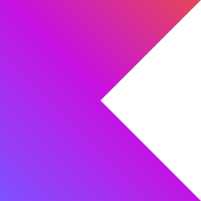](icons/kotlin.svg)
[](icons/kubernetes.svg)
[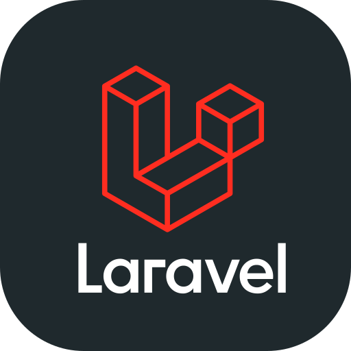](icons/laravel.svg)
[](icons/latex.svg)
[](icons/less.svg)
[](icons/lightroom.svg)
[](icons/linkedin.svg)
[](icons/linux-mint.svg)
[](icons/linux.svg)
[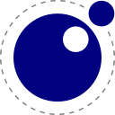](icons/lua.svg)
[](icons/magento.svg)
[](icons/mailgun.svg)
[](icons/mailjet.svg)
[](icons/mariadb.svg)
[](icons/markdown.svg)
[](icons/mastodon.svg)
[](icons/material-ui.svg)
[](icons/matter.svg)
[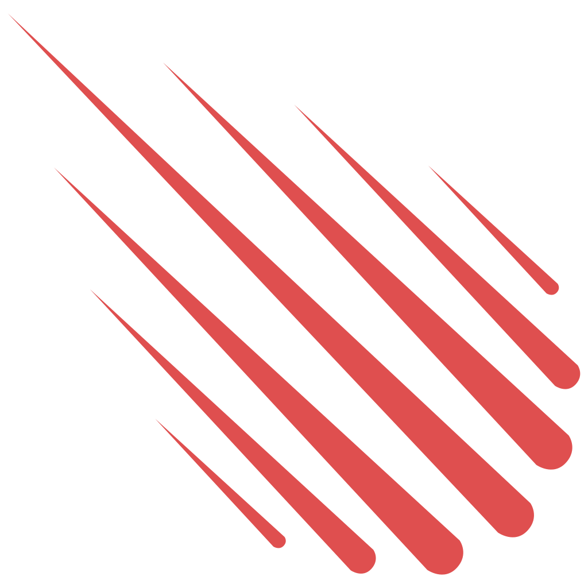](icons/meteor.svg)
[](icons/microsoft.svg)
[](icons/midjourney.svg)
[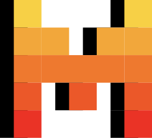](icons/mistral.svg)
[](icons/mocha.svg)
[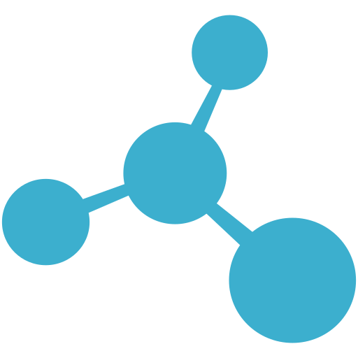](icons/molecular.svg)
[](icons/mongo-db.svg)
[](icons/my-sql.svg)
[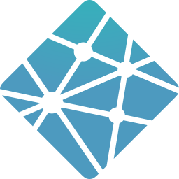](icons/netlify.svg)
[](icons/nette-tester.svg)
[](icons/nette.svg)
[](icons/next-js.svg)
[](icons/nginx.svg)
[](icons/node-js.svg)
[](icons/node-webkit.svg)
[](icons/notion.svg)
[](icons/npm.svg)
[](icons/nuxtjs.svg)
[](icons/openai.svg)
[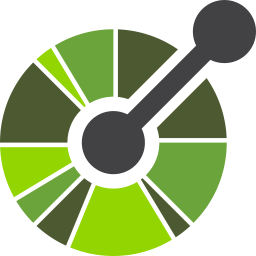](icons/openapi.svg)
[](icons/opencollective.svg)
[](icons/opensuse.svg)
[](icons/opera.svg)
[](icons/parcel.svg)
[](icons/paypal.svg)
[](icons/perl.svg)
[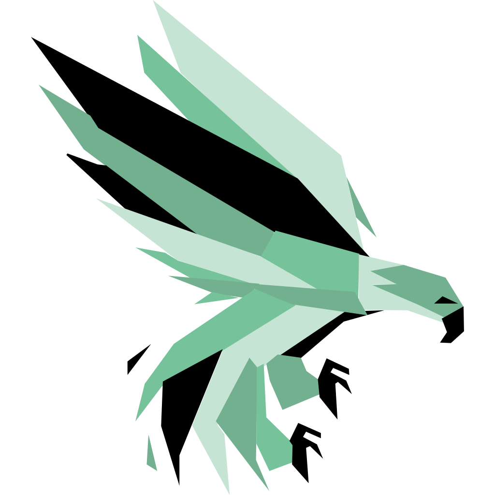](icons/phalcon.svg)
[](icons/phoenix.svg)
[](icons/php-storm.svg)
[](icons/php-unit.svg)
[](icons/php.svg)
[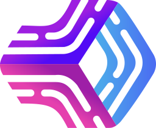](icons/pm2.svg)
[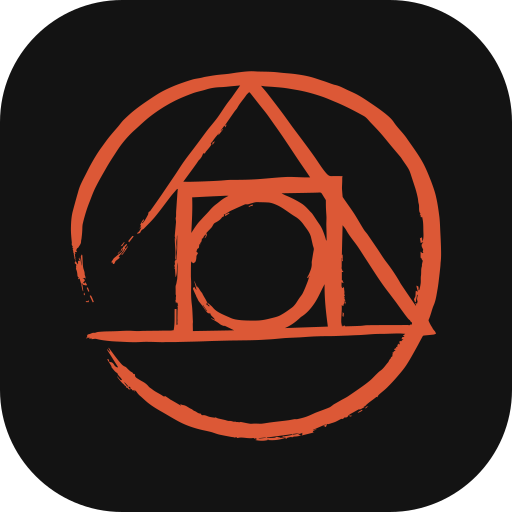](icons/postcss.svg)
[](icons/postgresql.svg)
[](icons/preact.svg)
[](icons/prettier.svg)
[](icons/prisma.svg)
[](icons/prometheus.svg)
[](icons/protractor.svg)
[](icons/pug.svg)
[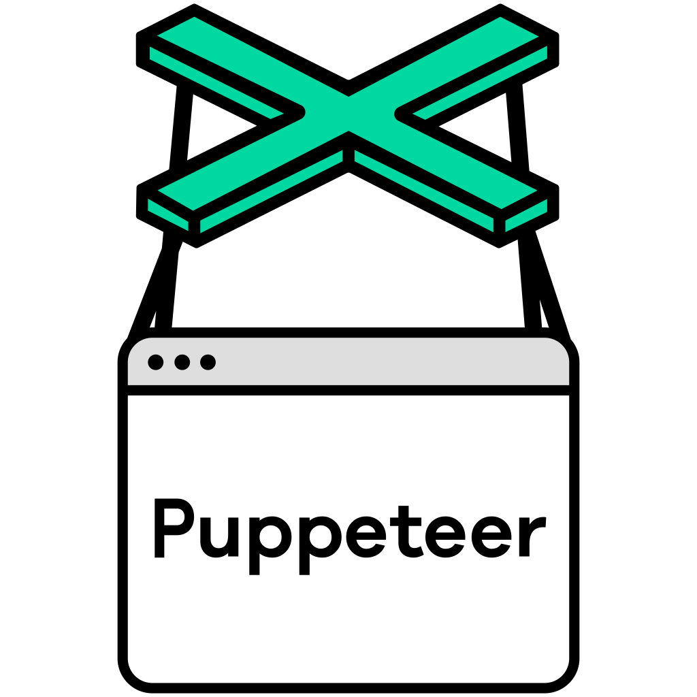](icons/puppeteer.svg)
[](icons/python.svg)
[](icons/rails.svg)
[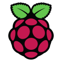](icons/raspberry-pi.svg)
[](icons/react.svg)
[](icons/reddit.svg)
[](icons/redhat.svg)
[](icons/redis.svg)
[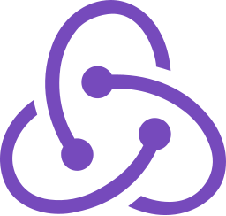](icons/redux.svg)
[](icons/remix.svg)
[](icons/rollupjs.svg)
[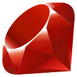](icons/ruby.svg)
[](icons/rust.svg)
[](icons/safari.svg)
[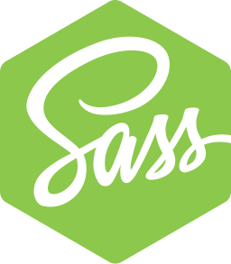](icons/sass.svg)
[](icons/scala.svg)
[](icons/selenium.svg)
[](icons/sendgrid.svg)
[](icons/sidekiq.svg)
[](icons/skype.svg)
[](icons/slack.svg)
[](icons/snowpack.svg)
[](icons/sqlite.svg)
[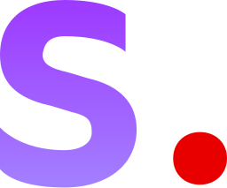](icons/stability-ai.svg)
[](icons/stack-overflow.svg)
[](icons/stylus.svg)
[](icons/svelte.svg)
[](icons/swift.svg)
[](icons/symfony.svg)
[](icons/tailwind-css.svg)
[](icons/telegram.svg)
[](icons/tiktok.svg)
[](icons/tomcat.svg)
[](icons/trello.svg)
[](icons/twitter.svg)
[](icons/type-script.svg)
[](icons/ubuntu.svg)
[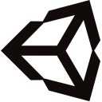](icons/unity.svg)
[](icons/unix.svg)
[](icons/unreal-engine.svg)
[](icons/vagrant.svg)
[](icons/vercel.svg)
[](icons/vim.svg)
[](icons/visual-studio-code.svg)
[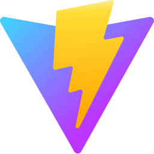](icons/vitejs.svg)
[](icons/vitest.svg)
[](icons/vivaldi.svg)
[](icons/vuejs.svg)
[](icons/vultr.svg)
[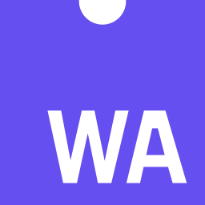](icons/webassembly.svg)
[](icons/webkit.svg)
[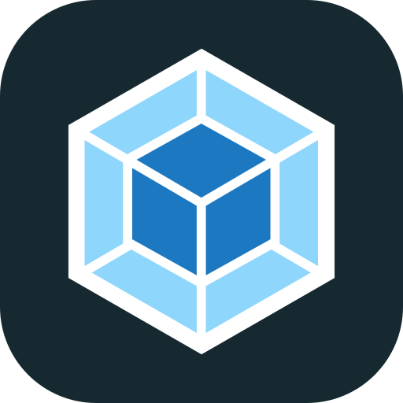](icons/webpack.svg)
[](icons/webstorm.svg)
[](icons/windows.svg)
[](icons/woo-commerce.svg)
[](icons/wordpress.svg)
[](icons/x.svg)
[](icons/xcode.svg)
[](icons/yarn.svg)
[](icons/yii.svg)
[](icons/you-tube.svg)
[](icons/zend.svg)

## License

[MIT](./LICENSE)